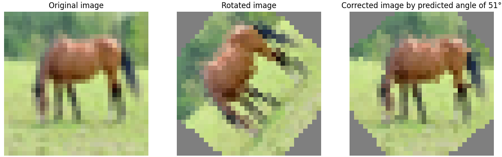

# RotationAnglePredictor

This code is the implementation of rotation angle prediction using classification and regression approaches based on 
different deep learning architectures, both custom network and standard networks such as ResNet (e.g. ResNet50) and 
vision transformer (e.g. Swin transformer).


## Overview
In this work, we design a deep learning network to learn rotation angle between two given square images. The 
network takes a pair of square images as input and predicts the rotation angle by which the first image has been rotated 
to produce the second. The image pairs are concatenated along the channel dimension and are fed into the network, and the 
rotation angle is estimated by learning the content of the image pairs. We experiment using different deep learning 
architectures, both custom network and standard networks such as ResNet (e.g. ResNet50) and vision transformer 
(e.g. Swin transformer). The designed networks are implemented using PyTorch deep learning framework. For our 
experimental analysis, we use the publicly available [CIFAR-10](https://www.cs.toronto.edu/~kriz/cifar.html) dataset. 
We generate synthetic image pairs and rotation angles for training and validation, considering a number of samples per 
image, from the CIFAR-10 dataset. To improve model generalization, we apply data augmentation to the train base image 
before rotation. We use cross-entropy loss and mean square error loss for the classification and regression approaches, 
respectively. In the classification approach, the rotation angles are discretized into 360 classes (one for each degree). 
We train the network for 50 epochs using Adam optimizer and base learning rate of 0.001 with StepLR learning rate 
scheduler. From the experiments, we find out that the classification-based approach is more robust than the 
regression-based approach.


A qualitative sample result of our proposed method is shown below.




## Installation

Go to the folder of this code and install dependencies to have the same environment configuration as the one we used. 
Note that we trained all models on a single NVIDIA GeForce RTX 2080 Ti GPU, on Windows OS.

```
cd RotationAnglePrediction
pip install -r requirements.txt
```

## Data Preparation
We use [CIFAR-10](https://www.cs.toronto.edu/~kriz/cifar.html) dataset for our experiment. We use the CIFAR-10 dataset 
from 'torchvision.datasets.CIFAR10'. Please look into `utils.py` for more details, particularly, the 
`generate_synthetic_pairs_classification` and `generate_synthetic_pairs_regression` functions for how synthetic image 
pairs and angles are generated, for classification and regression approaches, respectively. Note that the synthetic image pairs and 
angles are generated on-the-fly. Hence, it may take sometime computationally to generate synthetic image pairs and angles 
before it starts training.


## Train
To train on the CIFAR-10 dataset based on the classification approach, you need to run the following code on terminal:  

```
python train_cifar10_classification.py
```

Please look into the `train_cifar10_classification.py` for more details.

To train on the CIFAR-10 dataset based on the regression approach, you need to run the following code on terminal:  

```
python train_cifar10_regression.py
```

Please look into the `train_cifar10_regression.py` for more details.

## Inference
To conduct inference on the CIFAR-10 validation dataset using classification approach, you need 
to run the following code on terminal:

```
python  inference_classifier.py --model_name rotation_angle_classifier_custom_46_epoch.pth --test_index 60
```

Here test_index of 60 is used. You can use any number between 0 and 9999 since the CIFAR-10 validation set has 10000 images. 
Please look into the `inference_classifier.py` for more details. 

You can also conduct inference by providing two images as input: image 1 (original image) and image 2 (rotated image) 
as follows using terminal:

```
python  inference_classifier.py --model_name rotation_angle_classifier_custom_46_epoch.pth --image1 original_image.png --image2 rotated_image.png
```

Please look into the `inference_classifier.py` for more details. Note the model name (checkpoint name) to be used 
`rotation_angle_classifier_custom_46_epoch.pth` which can be different based on the network type used. 

Similarly, to conduct inference on the CIFAR-10 validation dataset using regression approach, you need 
to run the following code on terminal:

```
python  inference_regressor.py --model_name rotation_angle_regressor_custom.pth --test_index 60
```

Here test_index of 60 is used. You can use any number between 0 and 9999 since the CIFAR-10 validation set has 10000 images. 
Please look into the `inference_regressor.py` for more details. 

You can also conduct inference by providing two images as input: image 1 (original image) and image 2 (rotated image) 
as follows using terminal:

```
python  inference_regressor.py --model_name rotation_angle_regressor_custom.pth --image1 original_image.png --image2 rotated_image.png
```

Please look into the `inference_regressor.py` for more details. Note the model name (checkpoint name) to be used 
`rotation_angle_regressor_custom.pth` which can be different based on the network type used. 